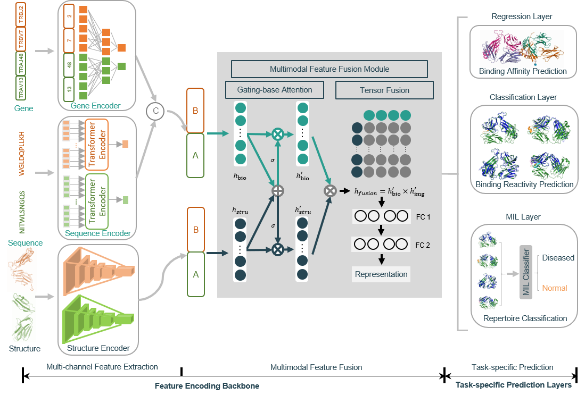

# DeepAIR

 

### DeepAIR: a deep-learning framework for effective integration of sequence and 3D structure to enable adaptive immune receptor analysis
Structural-docking-based binding between the adaptive immune receptors (AIRs), including T cell receptor (TCR) and B cell receptor (BCR), and the antigens is one of the most fundamental processes in adaptive immunity. However, current methods for predicting AIR-antigen binding largely rely on sequence-derived features of AIR. In this study, we present a deep-learning framework, termed DeepAIR, for the accurate prediction of AIR-antigen binding by integrating both sequence-derived and structure-derived features of AIRs. DeepAIR consists of three feature encoders, including a trainable-embedding-layer-based gene encoder, a transformer-based sequence encoder, and a pre-trained AlphaFold2-based structure encoder. DeepAIR deploys a gating-based attention mechanism to extract important features from the three encoders, and a tensor fusion mechanism to integrate obtained features for multiple tasks, including the prediction of AIR-antigen binding affinity, AIR-antigen binding reactivity, and the classification of the immune repertoire. We systematically evaluated the performance of DeepAIR on multiple datasets. DeepAIR shows outstanding prediction performance in terms of AUC (area under the ROC curve) in predicting the binding reactivity to various antigens, as well as the classification of immune repertoire for nasopharyngeal carcinoma (NPC) and inflammatory bowel disease (IBD). We anticipate that DeepAIR can serve as a useful tool for characterizing and profiling antigen-binding AIRs, thereby informing the design of personalized immunotherapy.

Flowchart of DeepAIR. DeepAIR has three major processing stages, including multi-channel feature extraction, multimodal feature fusion, and task-specific prediction. At the multi-channel feature extraction stage, three feature encoders are involved and used to extract informative features from the gene, sequence, and structure inputs. Then the resulting features produced by three different encoders are further integrated via a gating-based attention mechanism as well as the tensor fusion at the multimodal feature fusion stage to generate a comprehensive representation. Finally, at the task-specific prediction stage, specifically designed prediction layers are utilized to map the obtained representations to the output results. 

# install

(1) HuggingFace Transformer (Tensorflow Version: 4.19.4):
    [https://huggingface.co/docs/transformers/installation]

(2) other important packages including:
    scikit-learn                 0.23.2
    tensorflow-gpu               2.7.0
    biopython                    1.76    
    huggingface-hub              0.2.1
    matplotlib                   3.5.1
    numpy                        1.19.5
    pandas                       1.4.2
    tokenizers                   0.12.1
    transformers                 4.19.4

(3) ./maincode/requirements.txt describes more details of the requirements.

(4) download ProtBert-BFD model
    ProtBert-BFD is based on Bert model which pretrained on a large corpus of protein sequences in a self-supervised fashion, which is avaiable from [https://huggingface.co/Rostlab/prot_bert_bfd/tree/main]
    
    The downloaded model should be stored as:
    ./ProtTrans/prot_bert_bfd  \
        config.json
        special_tokens_map.json
        tf_model.h5
        tokenizer_config.json
        vocab.txt

# config file

(1) Edite the ./maincode/config.py file which provides the paths of the obtained DeepAIR models (A well-edited file is given as a default example.)

# runing

(1) for binding reactivity prediciton (BRP) (Classification)

    python ./maincode/DeepAIR_BRP.py  \
        --input_data_file  \ # path to the input table 
        --result_folder  \ #  folder to save the results
        --epitope  \ # selected epitope for the evaluation, can be a epitope such as "--epitope A1101_AVFDRKSDAK_EBNA-3B_EBV" 
                     # or a list of epitopes such as "--epitope A1101_AVFDRKSDAK_EBNA-3B_EBV A0201_GILGFVFTL_Flu-MP_Influenza" 
                     # (default = None)
        --AF2_feature_folder  \ # AF2 feature folder
        --transformer_model_folder  \ # folder to save the pretrained BERT model

(2) for binding affinity prediciton (BAP) (Regression)

    python ./maincode/DeepAIR_BAP.py 
        --input_data_file  \ # path to the input table 
        --result_folder  \ #  folder to save the results
        --epitope  \ # selected epitope for the evaluation, can be a epitope such as "--epitope A1101_AVFDRKSDAK_EBNA-3B_EBV" 
                     # or a list of epitopes such as "--epitope A1101_AVFDRKSDAK_EBNA-3B_EBV A0201_GILGFVFTL_Flu-MP_Influenza" 
                     # (default = None)
        --AF2_feature_folder  \ # AF2 feature folder
        --transformer_model_folder  \ # folder to save the pretrained BERT model

(3) for immune repertoire classification (Multiple instance learning (MIL))
    
    python ./maincode/DeepAIR_MIL.py 
        --input_data_file  \ # path to the input table (an immnue repertoire of a subject)
        --result_folder  \ #  folder to save the results
        --AF2_feature_folder  \ # AF2 feature folder
        --transformer_model_folder  \ # folder to save the pretrained BERT model
        --task \ # can be one of 'IBD_BCR' (inflammatory bowel disease (BCR)), 'IBD_TCR' (inflammatory bowel disease (TCR)), 'NPC_BCR' (nasopharyngeal carcinoma (BCR)), or 'NPC_TCR'(nasopharyngeal carcinoma (TCR))

# runing examples

(1) for binding reactivity prediciton (BRP) (Classification)

    python ./maincode/DeepAIR_BRP.py 

(2) for binding affinity prediciton (BAP) (Regression)

    python ./maincode/DeepAIR_BAP.py 

(3) for immune repertoire classification (Multiple instance learning (MIL))

    python ./maincode/DeepAIR_MIL.py 

# Dataset:

Example data are given in ./data

# Disclaimer
This tool is for research purpose and not approved for clinical use.

This is not an official Tencent product.

# Coypright

This tool is developed in Tencent AI Lab.

The copyright holder for this project is Tencent AI Lab.

All rights reserved.

# Citation

Zhao Y, He B, Li C, Xu Z, Su X, Rossjohn J, Song J, Yao J. DeepAIR: a deep-learning framework for effective integration of sequence and 3D structure to enable adaptive immune receptor analysis. bioRxiv.